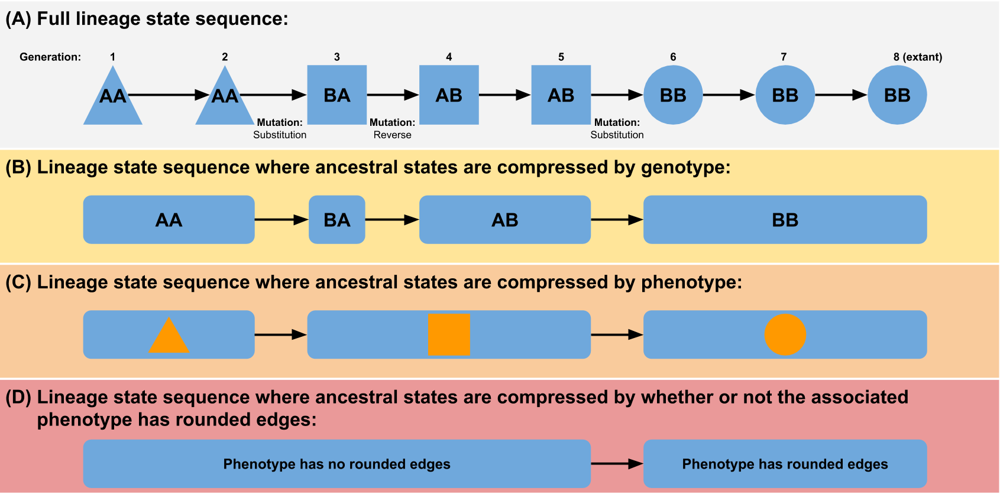

# Quantifying the tape of life: Ancestry-based metrics provide insights and intuition about evolutionary dynamics

This repo contains all of the code used to generate the paper (including running the experiments, doing data analysis, and
LaTeX code for the paper).

### Contents:
- **paper.tex**: LaTeX code for paper (submitted to ALife 2018).
- **LICENSE**: The MIT license, under which all of our code is available (note: this repository also contains code from the 
    [CEC benchmark functions repository](https://github.com/mikeagn/CEC2013), which is under the FreeBSD license)
- **paper**: Directory containing bibliography and style files for paper.tex (note that paper.tex has to be at the top level 
   of this repo to appease overleaf)
- **figs**: Directory containing all figures used in the paper.
- **experiment**: Directory containing all code that was used to run the experiment.
  - *Makefile*: Contains rules to build the experiment executable.
  - *OptimizationProblemExp.h*: This is where most of the code specific to this experiment lives.
  - *optimization-config.h*: Defines configuration settings for these experiments.
  - *optimization_problems.cc*: Contains all code specific to running this experiment on the command line
     (as opposed to in a web browser)
  - *scripts*: Contains scripts used for wrangling jobs on our High-Performance Computing Cluster.
  - *CEC2013*: Contains the C++ implementation of the CEC benchmark functions. From [here](https://github.com/mikeagn/CEC2013).
- **analysis**:  Directory containing all code used to analyze the data
  - *data_analysis.Rmd*: R-markdwon file containing all of the stats and plotting code
  - *fitness_landscape_visualization*: Code to make the WebVR fitness landscape data visualization (this is a submodule, 
    linked to the [this repository](https://github.com/emilydolson/fitness_landscape_visualizations)). Note that all data for
    this experiment is in the data subdirectory of this submodule.
  - *cec_python_library*: Contains code that depends on the CEC benchmark function Python implementation:
    - cec2013: the Python implementation of the CEC benchmark functions. From [here](https://github.com/mikeagn/CEC2013).
    - data: Precalculated data that the code in cec2013 relies on. From [here](https://github.com/mikeagn/CEC2013).
    - LICENSE.txt: License for the CEC benchmark function implementations.
    - analyze_landscapes.py: A python script to the generate the heat maps and upper and lower bounds data used by the
      webvr visualization.
    - extract_dominant_lineage_info.py: A script to extract data about the dominant lineage from each condition (phenotypic volatility and the full path) post hoc.
    

Note about git history: This paper was split off from a larger project. To simplify reproducing the data described here, 
we have created this new repository. The full git history for all of these files can be found in the [original repo](https://github.com/stevenjson/ALife2018-LineageOthello);
